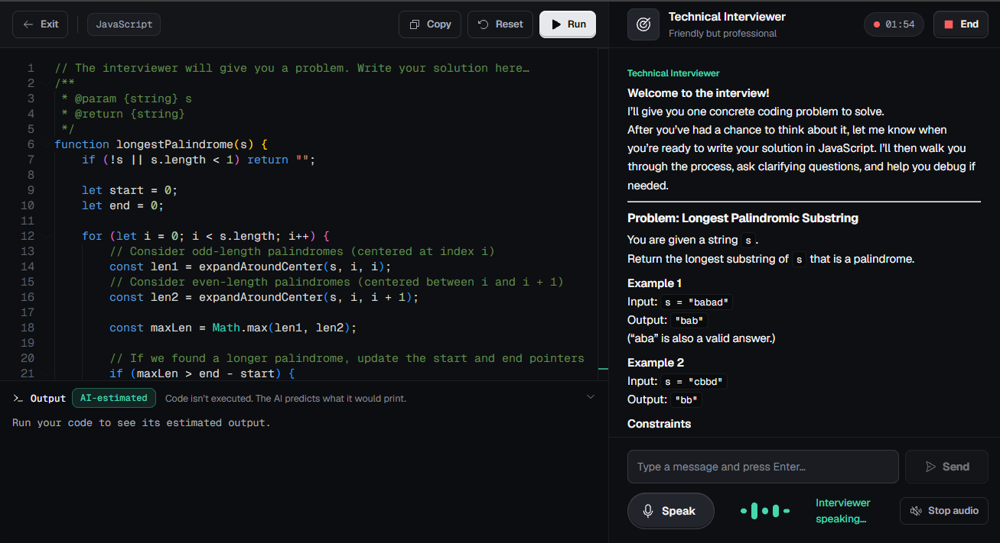

# MockMate — AI Interview Simulator

**Rehearse the interview, not just the problem.** MockMate puts you in a live technical interview with an AI interviewer that listens to you think out loud, reads the code in your editor, and ends the session with a scored report on both your coding and your communication.

<p align="center">
  
</p>

<p align="center">
  
  
  
  
  
  
  
</p>

<p align="center">
  <a href="https://mockmate-ai-interview.netlify.app/"><b>Live demo</b></a> ·
  <a href="#features">Features</a> ·
  <a href="#how-code-is-checked">How code is checked</a> ·
  <a href="#getting-started">Getting started</a> ·
  <a href="#deployment">Deployment</a>
</p>

---

## Why MockMate

Most interview prep tools are silent problem banks: solve, submit, pass or fail. Real interviews are conversations. You explain your approach, react to hints, and write code while someone watches. MockMate is built around that part:

- **Voice first.** You speak and the interviewer answers out loud.
- **Persona driven.** Each arena has its own interviewer with its own focus and style.
- **Two scores.** Every session is graded on coding *and* communication, with written feedback you can act on in the next session.
- **Clear about what is real.** The UI always says whether code actually ran or was evaluated by the AI.

No sign-up. Open the site, pick an arena, and you are in an interview.

## Features

### 🎙️ Voice interviews
Answer by speaking. The browser transcribes your speech, the AI interviewer replies in real time over a SignalR connection, and reads its reply aloud. A live transcript and an audio visualizer keep the conversation on screen.

### 🏟️ Eight interview arenas

| Arena | Interviewer | Format |
|---|---|---|
| Google Algorithms | Senior Google Engineer | Coding: data structures, graphs, Big-O |
| Grill My Résumé | Hiring Manager | Upload a PDF; questions about *your* projects |
| Meta Frontend | Meta Frontend Engineer | Coding: UI components, React, state |
| System Design | Principal Engineer | Conversation only: scaling, caching, trade-offs |
| SQL & Data | Data Engineer | Coding in SQL: joins, aggregation, window functions |
| Amazon Leadership | Amazon Bar Raiser | Behavioral: Leadership Principles, STAR |
| DevOps & Cloud | Platform / SRE Lead | YAML: CI/CD, containers, infra-as-code |
| Startup Velocity | Startup CTO | Coding: pragmatic full-stack work |

> Arena names describe an interview *style*. MockMate is not affiliated with or endorsed by any company named here.

### 💻 A real editor
Monaco (the editor behind VS Code) with a custom theme, in eight languages: **JavaScript, TypeScript, Python, Java, C#, C++, Go and Rust**. SQL and YAML are fixed in their arenas. Press **Run** and the output appears in a console under the editor.

### 🧩 Practice mode
A self-paced page with no interviewer. Pick a topic (Arrays, Strings, Linked Lists, Trees, Graphs, Dynamic Programming) and a difficulty, and MockMate generates a problem with:

- a **typed function signature** and a starter for each of the eight languages,
- **JSON test cases**,
- a **hidden reference solution** that checks the tests.

When a problem is generated, the browser runs the reference solution against every test and drops any test whose expected answer it contradicts. So the tests you are graded on are confirmed by working code, not only written by the AI. If the reference itself fails, the tests are shown as *unverified*.

**Run** checks your code against the first example. **Check** runs it against every test.

### 📊 Scored report and dashboard
Ending an interview produces a report with a **coding score**, a **communication score**, and written feedback. Interviews and practice attempts are saved to a **Dashboard** with stats and a score trend chart. For practice, the best attempt per problem is kept. History is stored in the browser, so no account is needed.

### 🎚️ "Recording Studio" design
A dark, quiet interface built like a recording booth: near-black surfaces, one mint accent for actions, red for the recording mic and the live-session dot, and Geist / Geist Mono type. The full design system (color tokens, type scale, spacing, components) is documented in [`DESIGN.md`](DESIGN.md).

## How code is checked

MockMate uses two engines, and every result is labeled with the engine that produced it.

| | Languages | How it works | Label |
|---|---|---|---|
| **Browser engine** | JavaScript, TypeScript, Python | The code actually runs in a Web Worker in your browser. TypeScript is stripped with [sucrase](https://github.com/alangpierce/sucrase); Python runs on [Pyodide](https://pyodide.org) (CPython compiled to WebAssembly). Nothing is sent to a server. | **Executed** |
| **AI engine** | Java, C#, C++, Go, Rust | The code does not run. In Practice, the model predicts what the function returns for each test **without seeing the expected answers**, and the *server* compares the prediction with the answer. In the interview room, the model predicts what the program prints. SQL and YAML use this engine too. | **AI-checked** (Practice) · **AI-estimated** (interview) |

Hiding the expected answers from the model matters. If the model saw them, it could simply report that the code passes. Because the server does the comparison, a broken solution in Java or C++ still fails.

## Architecture

```
┌────────────────────────────────┐                          ┌─────────────────────────────────┐
│  React 19 SPA  (Netlify)       │   REST + SignalR (WSS)   │  .NET 9 API  (Fly.io)           │
│                                │ ───────────────────────▶ │                                 │
│  • Monaco editor               │  /interviewHub           │  InterviewHub   ─┐              │
│  • Web Speech  (STT / TTS)     │  /api/problem/generate   │  ProblemService  │              │
│  • Web Workers                 │  /api/problem/check      │  AiCheckService  ├──▶ Groq API  │
│     ├─ JS / TS  (sucrase)      │  /api/code/run           │  CodeExecution   │  gpt-oss-20b │
│     └─ Python   (Pyodide)      │  /api/resume/upload      │  GroqAiService  ─┘              │
│  • localStorage history        │                          │  PdfPig (résumé text)           │
└────────────────────────────────┘                          │  Rate limiter: 20 req / 10 min  │
                                                            └─────────────────────────────────┘
```

- The conversation history for each interview is stored **per SignalR connection** (`ConversationStore`). Sessions are isolated, and the history is dropped when the report is generated or the tab closes.
- Arenas are defined once in `mockmate-ui/src/lib/modes.ts`. The backend persona prompts in `GroqAiService` use the same `id` values.
- The Fly machine **suspends when idle**. The first request after a quiet period can take about a second longer while it wakes up.

## Tech stack

| Layer | Technology |
|---|---|
| Frontend | React 19, TypeScript 5.9, Vite 8, React Router 7, Monaco Editor, react-markdown, Phosphor Icons, Geist fonts |
| Realtime | ASP.NET Core SignalR over WebSockets (`@microsoft/signalr`) |
| Voice | Web Speech API: `SpeechRecognition` (speech-to-text) and `SpeechSynthesis` (text-to-speech) |
| In-browser execution | Web Workers, sucrase (TypeScript), Pyodide 0.26 (Python) |
| Backend | .NET 9, ASP.NET Core Web API, built-in rate limiting |
| AI | Groq API, `openai/gpt-oss-20b` (configurable) |
| PDF | UglyToad.PdfPig for résumé text extraction |
| Storage | Browser `localStorage` |
| Hosting | Fly.io (API, Docker) and Netlify (frontend) |

## Getting started

### Prerequisites

- [.NET 9 SDK](https://dotnet.microsoft.com/download)
- [Node.js 22](https://nodejs.org/) (Vite 8 needs Node 20.19 or newer)
- A free Groq API key from [console.groq.com](https://console.groq.com)
- **Chrome or Edge** for the voice features. Other browsers can still use the editor and Practice mode.

### 1. Clone

```bash
git clone https://github.com/wingtion/MockMate-AI-Interview-Simulator.git
cd MockMate-AI-Interview-Simulator
```

### 2. Backend

```bash
cd MockMate.API
dotnet user-secrets set "GroqApiKey" "gsk_your_key_here"   # stored outside the repo
dotnet run
```

The API listens on **http://localhost:5000**.

### 3. Frontend

```bash
cd mockmate-ui
npm install
npm run dev
```

Open **http://localhost:5173** in Chrome or Edge and allow microphone access when asked.

## Configuration

| Setting | Where | Purpose |
|---|---|---|
| `GroqApiKey` | user-secrets (local) / Fly secret (production) | Groq API key. Required. |
| `GroqModel` | appsettings / env / Fly secret | Overrides the model. Default is `openai/gpt-oss-20b`. Groq retires models over time, so this is configurable. |
| `AllowedOrigins` | Fly secret | Comma-separated frontend URLs allowed by CORS. `http://localhost:5173` is always allowed. |
| `VITE_API_URL` | `mockmate-ui/.env` | API base URL. Defaults to `http://localhost:5000`. See `.env.example`. |

## API reference

| Method | Endpoint | Description |
|---|---|---|
| `HUB` | `/interviewHub` → `ProcessUserAudio` | Sends the candidate's message and current code; the AI reply comes back as `ReceiveAiResponse` |
| `HUB` | `/interviewHub` → `EndSession` | Generates the scored report (coding, communication, feedback) |
| `GET` | `/api/problem/generate?topic=&difficulty=` | Generates a typed Practice problem with tests, reference solution and starters |
| `POST` | `/api/problem/check` | AI check for Java, C#, C++, Go, Rust. Rate limited. |
| `POST` | `/api/code/run` | AI-estimated program output for the interview room. Rate limited. |
| `POST` | `/api/resume/upload` | Extracts text from a PDF résumé |

## Deployment

The production setup uses free tiers of both services.

1. **Backend first.** From `MockMate.API/` (where `fly.toml` and the `Dockerfile` are):
   ```bash
   fly secrets set GroqApiKey=gsk_... AllowedOrigins=https://your-site.netlify.app
   fly deploy
   ```
   The app runs on a `shared-cpu-1x` / 256 MB machine in `fra` that suspends when idle.

2. **Then the frontend.** Push to `main`. Netlify builds `mockmate-ui/` using `netlify.toml` (Node 22, SPA fallback) and deploys automatically. Set `VITE_API_URL` to the Fly URL in the Netlify environment settings.

Deploy the backend first, so the new frontend never calls an API that does not have its endpoints yet.

## Limits

MockMate runs on free tiers, so a few limits apply:

- **Groq free tier.** All AI features share one quota: about 8,000 tokens per minute and 200,000 tokens per day for `gpt-oss-20b`. When it runs out, AI replies, problem generation and AI checks pause until the quota resets. Every AI surface shows a loading, error and retry state.
- **Rate limit.** Server-side code runs and AI checks are limited to 20 requests per visitor every 10 minutes.
- **AI-checked is not executed.** Results for Java, C#, C++, Go and Rust are well-grounded predictions, not a compiler. They are labeled that way on purpose.
- **History is local.** It lives in your browser's `localStorage` and does not sync between devices.

## Project structure

```
MockMate-AI-Interview-Simulator/
├── MockMate.API/                  # .NET 9 backend
│   ├── Controllers/               # Code, Problem, Resume
│   ├── Hubs/InterviewHub.cs       # SignalR interview session
│   ├── Services/                  # GroqAiService, ProblemService, AiCheckService,
│   │                              # CodeExecutionService, AnswerComparer, ConversationStore
│   ├── Models/
│   ├── Dockerfile
│   └── fly.toml
├── mockmate-ui/                   # React + Vite frontend
│   └── src/
│       ├── pages/                 # Home, Interview, Practice, Dashboard
│       ├── components/            # AudioVisualizer, OutputConsole, ScoreChart, Modal, Toast…
│       └── lib/                   # modes, engine, runner (Web Workers), practice, api, history
├── DESIGN.md                      # "Recording Studio" design system
├── PRODUCT.md                     # Product brief and principles
└── netlify.toml
```

## Roadmap

- Accounts and history that sync across devices
- Shareable and downloadable report cards

## Author

**Doğan Süle** · [GitHub](https://github.com/wingtion) · [LinkedIn](https://www.linkedin.com/in/do%C4%9Fan-s%C3%BCle/)

If you try MockMate, feedback and issues are welcome.
